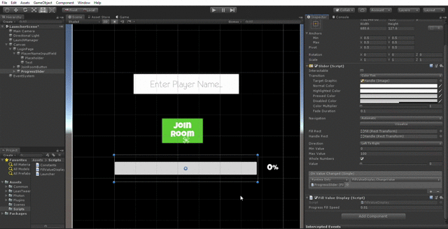

# Useful-Assets
Contains commonly and repeatedly used scripts and useful assets needed when developing applications in Unity.
Find :

**_Common Scripts_** - **Links to public gists are provided below with a brief description as to their purpose. It's faster to access and maintain immutability imo. We can create a folder to store the scripts, but that would be difficult to manage since we need to push and fetch everytime we need a script.**

1. [ButtonHitZone.cs](https://gist.github.com/sid68v/1de7b7765201e03ecab313ec50ba67c9) : *An efficient script for unity for increasing the touch area of UI elements especially buttons for better experience. Simply attach to the needed buttons as       an extra component. no value need be set.*
 
2. [ObjectPooler.cs](https://gist.github.com/sid68v/235b7db29846b5434ffd98ae40d33345) : *A generic script for object pooling.*

3. [CameraFollow.cs](https://gist.github.com/sid68v/219bf071db71405f631aad8c9f8f9d79) : *A standard camera controller script that can be attached to the MainCamera to follow and rotate along with the player.*

4. [Rotator.cs](https://gist.github.com/sid68v/3b4553920e3096d2ab3a7c9a14003c49) : *Basic Rotation script around Y axis.*

5. [AnchorsToCorners.cs](https://gist.github.com/sid68v/301825b835e2ef96907e6698c5f5ea2f) : *To anchor UI elements in fixed positions. needs to be commented before building app. credits to https://github.com/refreshlearn/Unity3DScripts*

**_UI and associated prefabs_** - go to **[/UnityPackages](/UnityPackages)**

**UI**
1. *[Progressbar](/UnityPackages/ProgressBar)*  

